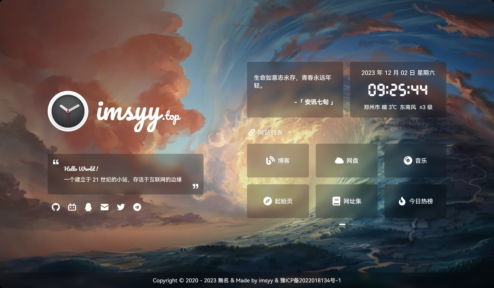

> [!NOTE]
> 本项目 Fork 自 [imsyy/home](https://github.com/imsyy/home)，在此基础上新增了可视化管理面板、小米天气 API 集成、多源天气自动轮换等功能。感谢原作者的优秀作品。

<p align="center">
  <strong><h2>🏠 个人主页</h2></strong>
  简约的个人导航主页，支持天气、音乐、一言、时光进度条
</p>



> 基于 [imsyy/home](https://github.com/imsyy/home) 二次开发，新增可视化管理面板、多源天气自动轮换等功能。

---

## ✨ 功能

- [x] 载入动画
- [x] 站点简介 / Hitokoto 一言
- [x] 日期及时间 / 时光进度条
- [x] **实时天气 — 5 源自动轮换**（小米 / 高德 / Open-Meteo / wttr.in）
- [x] 音乐播放器（网易云 / QQ 音乐）
- [x] **可视化管理面板**（Ctrl+Shift+E 打开，首次密码 `admin`）
- [x] 移动端适配 / PWA 离线缓存

---

## 🚀 快速开始

### 环境要求

> Node.js > 16.16.0  
> pnpm > 8.x

```bash
# 1. 克隆项目
git clone https://github.com/rswcdcbxc/zhuye.git
cd zhuye

# 2. 配置环境变量
cp .env.example .env
# 编辑 .env 按需修改站点名称、音乐歌单等

# 3. 安装依赖
pnpm install

# 4. 开发预览
pnpm dev

# 5. 生产构建
pnpm build
```

构建产物在 `dist/` 目录，上传到任意静态服务器即可。

### Docker 部署

```bash
docker build -t home .
docker run -p 12445:12445 -d home
```

### 🪟 Windows 部署（Node.js）

```powershell
# 1. 安装 Node.js（如已安装可跳过）
# 前往 https://nodejs.org 下载 LTS 版本并安装

# 2. 克隆项目
git clone https://github.com/rswcdcbxc/zhuye.git
cd zhuye

# 3. 配置环境变量
copy .env.example .env
# 编辑 .env 按需修改站点名称、音乐歌单等

# 4. 安装 pnpm
npm install -g pnpm

# 5. 安装依赖
pnpm install

# 6. 开发模式运行（支持热更新）
pnpm dev

# 或者构建后预览
pnpm build
pnpm preview
```

> `pnpm dev` 启动开发服务器，默认 http://localhost:3000  
> `pnpm build && pnpm preview` 构建生产版本并预览，默认 http://localhost:4173

### 🐧 Linux 部署（Node.js）

```bash
# 1. 安装 Node.js（如已安装可跳过）
curl -fsSL https://deb.nodesource.com/setup_20.x | sudo -E bash -
sudo apt install -y nodejs

# 2. 克隆项目
git clone https://github.com/rswcdcbxc/zhuye.git
cd zhuye

# 3. 配置环境变量
cp .env.example .env
# 编辑 .env 按需修改站点名称、音乐歌单等

# 4. 安装 pnpm
npm install -g pnpm

# 5. 安装依赖
pnpm install

# 6. 开发模式运行（支持热更新）
pnpm dev

# 或者构建后预览
pnpm build
pnpm preview
```

> `pnpm dev` 启动开发服务器，默认 http://localhost:3000  
> `pnpm build && pnpm preview` 构建生产版本并预览，默认 http://localhost:4173

---

## 📋 更新日志

### v1.0 (2026-05-31)

- 🎉 基于 [imsyy/home](https://github.com/imsyy/home) 首次发布
- ☁ **新增小米天气 API**，5 源天气自动轮换
- 🔧 **新增可视化管理面板**（Ctrl+Shift+E）
- 🔐 **管理面板密码认证**（默认 `admin`，SHA-256 存储）
- 🔗 社交链接 / 网站链接可视化编辑 + 拖拽排序
- 📝 站点信息在线编辑（名称/作者/简介/备案号）
- 📥 JSON 配置导入导出
- 🎨 管理面板毛玻璃风格适配

---

## 🔧 可视化管理面板


> **🔐 首次密码：`admin`**（登录后可在「修改密码」标签中更改）

**无需改代码即可修改联系方式、网站链接、站点信息！**

| 入口 | 操作 |
| --- | --- |
| 快捷键 | `Ctrl + Shift + E` |
| 页脚图标 | 鼠标悬停页脚右侧齿轮 |

| 功能 | 说明 |
| --- | --- |
| 🔗 社交链接 | 增删改 GitHub/B站/QQ/Email 等，支持拖拽排序 |
| 🌐 网站链接 | 增删改博客/网盘等快捷链接，下拉选择图标 |
| 📝 站点信息 | 改站点名称、作者、简介、备案号、欢迎语 |
| 🔑 修改密码 | 面板内修改认证密码（默认 `admin`） |
| 📥 导出 JSON | 下载配置备份 |
| 📤 导入 JSON | 从文件恢复配置 |

> 配置保存在浏览器 localStorage，刷新不丢失。导出 JSON 可放入仓库永久部署。

---

## ☁ 天气系统


5 层天气源自动轮换，一个失效自动切换下一个：

| 优先级 | 来源 | 说明 |
| --- | --- | --- |
| 1 | **小米天气** | 免费，数据最全（实时温度/体感/AQI/分钟降水/15天预报） |
| 2 | 高德天气 | 需配置 `VITE_WEATHER_KEY` |
| 3 | Open-Meteo | 免费，全球覆盖 |
| 4 | wttr.in | 免费，IP 自动定位 |
| 5 | 教书先生 | 旧备用 |

> 无需配置任何 Key 即可使用（默认走小米天气）。

---

## 🎵 音乐

在 `.env` 中配置：

```bash
VITE_SONG_API = "https://api.injahow.cn/meting/"  # Meting API 地址
VITE_SONG_SERVER = "netease"   # netease / tencent
VITE_SONG_TYPE = "playlist"    # song / playlist / album
VITE_SONG_ID = "7452421335"    # 歌单 ID
```

---

## 🛠 技术栈

- Vue 3 + Vite 4
- Pinia（状态管理 + localStorage 持久化）
- Element Plus / IconPark / xicons
- Aplayer 音乐播放器
- Swiper 轮播
- PWA 离线支持

---

## 📡 API 来源

| 用途 | API |
| --- | --- |
| 天气 | 小米天气 / 高德开放平台 / Open-Meteo / wttr.in |
| 一言 | Hitokoto |
| IP 定位 | ip-api.com |
| 音乐 | Meting API |

---

## 📄 License

基于 [imsyy/home](https://github.com/imsyy/home) 修改，遵循原项目许可证。
